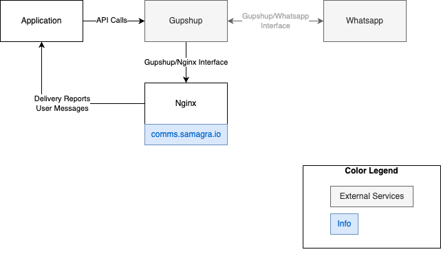

# Gupshup-integration
Gupshup is an engagement tool used by us primarily to send whatsapp messages through their chatbot interface.

## Setup

**Functioning:**   

For an application seeking use Gupshup to establish a Whatsapp interface;

- The Application makes authenticated API Calls to Gupshup as elaborated in the [Enterprise Guide](Gupshup Enterprise Pull API Document.pdf).
- Gupshup interfaces with Whatsapp to send messages and recieve responses.
- Nginx recieves delivery reports, user messages, and other responses from Gupshup webhook.
- Nginx acts as a Reverse Proxy and sends relevant data to the application.

## Nginx: Configuration and Usage

*Reference: [Nginx Beginners Guide](https://nginx.org/en/docs/beginners_guide.html)*

